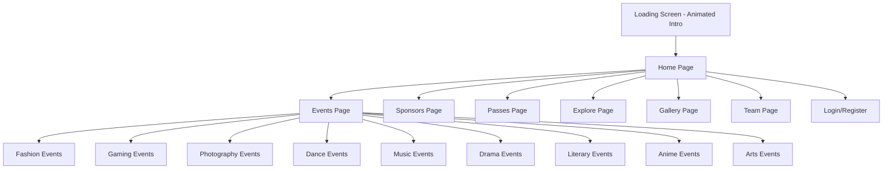

# PRISMA 2025 - Murder Mystery Themed Tech Fest Website

## 📋 Project Overview

Transform the PRISMA tech fest website with an immersive **murder mystery theme** combining the advanced features of MILAN website with the event structure of PRISMA. Key features include:
- **Animated intro/loading screen** (like MILAN)
- **Mystery Artist reveal** with question mark placeholder
- **Countdown timer** to the event
- **Floating navigation** with hamburger menu
- **Smooth scroll animations** and parallax effects
- **Event category cards** with hover effects
- **Gallery section** with lightbox
- **Team section** with member cards
- **Sponsors carousel**
- **Pass/Registration system**
- Dark, mysterious aesthetic with detective/crime scene elements

---

## 🎨 Murder Mystery Theme Concept

### Visual Identity
- **Color Palette**: Deep crimson red, midnight black, gold accents, fog gray
- **Typography**: Serif fonts for headings (mysterious feel), clean sans-serif for body
- **Imagery**: Crime scene tape, magnifying glass, fingerprints, case files, shadows
- **Atmosphere**: Noir detective aesthetic with subtle animations

### Theme Elements
1. **Hero Section**: "The Case of PRISMA 2025" - Event presented as an unsolved mystery
2. **Mystery Artist**: Silhouette with question mark, "SUSPECT UNKNOWN" label
3. **Countdown Timer**: Styled as evidence countdown "Time Until Case Opens"
4. **Events**: Presented as "Case Files" or "Evidence"
5. **Navigation**: Styled as detective's notebook tabs

---

## 🏗️ Site Architecture



---

## 📄 Page Structure (MILAN-Style Features)

### 1. Loading/Intro Screen (Like MILAN)
- Animated logo reveal with murder mystery theme
- Progress bar styled as "Case Loading..."
- Blood drip or fog animation
- Skip button in corner
- Transitions smoothly to home page

### 2. Home Page
- **Floating Navigation Bar** (Like MILAN)
  - Centered pill-shaped nav with hamburger menu
  - Smooth dropdown with all page links
  - Sticky on scroll with blur background
  
- **Hero Section**
  - Full-screen with parallax background
  - Event title: "PRISMA 2025 - The Mystery Unfolds"
  - Animated text reveal
  - Countdown timer styled as evidence clock
  - Dual CTA buttons: "Grab Your Passes" / "Explore Events"
  - Scroll indicator at bottom
  
- **Mystery Artist Section** (NEW)
  - Large question mark silhouette with glow effect
  - "SUSPECT IDENTITY: CLASSIFIED" stamp
  - Animated fog/smoke particles
  - Reveal countdown timer
  - Glitch effect on hover

- **Event Highlights Carousel**
  - Featured events as "Top Case Files"
  - Auto-scrolling with manual controls
  - Hover to pause

- **Sponsors Marquee**
  - Infinite scrolling sponsor logos
  - "Investigation Partners" heading

- **Footer**
  - Social links, quick navigation
  - "Crafted with 🔍 by Team PRISMA"

### 3. Events Page (Like MILAN)
- Hero section with "Evidence Room" theme
- "Experience X+ events" tagline
- Prize pool highlight
- **Event Category Cards** (Grid Layout)
  - Beautiful gradient backgrounds
  - Category icon and name
  - Event count badge
  - Brief description
  - "View Events" and "Rulebook" buttons
  - Hover lift effect with shadow

### 4. Sponsors Page
- Tiered sponsor display (Title, Gold, Silver, Bronze)
- Logo cards with hover effects
- "Become a Sponsor" CTA

### 5. Passes Page (Like MILAN)
- Pass types with pricing
- Features comparison
- "Grab Your Pass" buttons
- QR code for registration

### 6. Explore Page
- Interactive campus map or venue info
- Schedule/Timeline
- FAQs accordion

### 7. Gallery Page
- Masonry grid of past event photos
- Lightbox on click
- Filter by year/event type

### 8. Team Page
- Organizing committee cards
- Photo, name, role, social links
- Hover flip effect

### 9. Login/Register (Optional)
- User authentication
- Pass purchase history
- Event registration status

---

## 🛠️ Technical Stack

### Confirmed Stack
- **Framework**: React 18 with Vite
- **Styling**: Tailwind CSS v3 + custom CSS for animations
- **Animations**: Framer Motion for page transitions and scroll animations
- **Advanced Animations**: GSAP for complex sequences
- **3D Effects**: Three.js / React Three Fiber (for intro animation)
- **Icons**: Lucide React
- **Routing**: React Router v6
- **State Management**: Zustand (lightweight) or Context API
- **Form Handling**: React Hook Form
- **Image Optimization**: Sharp / lazy loading
- **Deployment**: Vercel / Netlify

---

## 📁 Project Structure

```
prisma-murder-mystery/
├── public/
│   ├── images/
│   │   ├── events/           # Event category images
│   │   ├── gallery/          # Past event photos
│   │   ├── sponsors/         # Sponsor logos
│   │   ├── team/             # Team member photos
│   │   ├── mystery/          # Mystery theme assets
│   │   └── backgrounds/      # Hero backgrounds
│   ├── fonts/                # Custom fonts
│   └── favicon.ico
├── src/
│   ├── components/
│   │   ├── common/
│   │   │   ├── Navbar.jsx           # Floating pill navbar
│   │   │   ├── MobileMenu.jsx       # Hamburger menu dropdown
│   │   │   ├── Footer.jsx
│   │   │   ├── ScrollIndicator.jsx
│   │   │   ├── PageTransition.jsx
│   │   │   └── Button.jsx
│   │   ├── home/
│   │   │   ├── LoadingScreen.jsx    # Animated intro
│   │   │   ├── Hero.jsx
│   │   │   ├── CountdownTimer.jsx
│   │   │   ├── MysteryArtist.jsx
│   │   │   ├── EventHighlights.jsx
│   │   │   └── SponsorsMarquee.jsx
│   │   ├── events/
│   │   │   ├── EventHero.jsx
│   │   │   ├── EventCategoryCard.jsx
│   │   │   ├── EventGrid.jsx
│   │   │   └── EventModal.jsx
│   │   ├── gallery/
│   │   │   ├── GalleryGrid.jsx
│   │   │   └── Lightbox.jsx
│   │   ├── team/
│   │   │   └── TeamCard.jsx
│   │   ├── passes/
│   │   │   └── PassCard.jsx
│   │   └── ui/
│   │       ├── Card.jsx
│   │       ├── Badge.jsx
│   │       └── Input.jsx
│   ├── pages/
│   │   ├── Home.jsx
│   │   ├── Events.jsx
│   │   ├── Sponsors.jsx
│   │   ├── Passes.jsx
│   │   ├── Explore.jsx
│   │   ├── Gallery.jsx
│   │   ├── Team.jsx
│   │   └── Contact.jsx
│   ├── hooks/
│   │   ├── useScrollAnimation.js
│   │   ├── useCountdown.js
│   │   └── useMediaQuery.js
│   ├── styles/
│   │   ├── globals.css
│   │   ├── animations.css
│   │   └── fonts.css
│   ├── data/
│   │   ├── events.json
│   │   ├── sponsors.json
│   │   ├── team.json
│   │   └── passes.json
│   ├── utils/
│   │   └── helpers.js
│   ├── App.jsx
│   ├── main.jsx
│   └── router.jsx
├── index.html
├── package.json
├── tailwind.config.js
├── postcss.config.js
├── vite.config.js
└── README.md
```

---

## ⏱️ Countdown Timer Component

### Features
- Days, Hours, Minutes, Seconds display
- Styled as evidence/case timer
- Animated flip or slide transitions
- Target date: Feb 28, 2025 (or configurable)

### Design
```
┌─────────────────────────────────────────┐
│     ⏰ TIME UNTIL CASE OPENS ⏰          │
├─────────┬─────────┬─────────┬──────────┤
│   14    │   08    │   32    │    15    │
│  DAYS   │  HOURS  │   MINS  │   SECS   │
└─────────┴─────────┴─────────┴──────────┘
```

---

## 🎭 Mystery Artist Section

### Design Concept
- Dark silhouette figure with animated question mark
- "IDENTITY CLASSIFIED" stamp overlay
- Fog/smoke particle effects
- Optional: Countdown to artist reveal
- Glitch effect on hover

### Content
```
┌─────────────────────────────────────┐
│                                     │
│         [?] SILHOUETTE [?]          │
│                                     │
│    ━━━━━━━━━━━━━━━━━━━━━━━━━━━━    │
│    SUSPECT: UNKNOWN                 │
│    STATUS: CLASSIFIED               │
│    REVEAL: COMING SOON              │
│    ━━━━━━━━━━━━━━━━━━━━━━━━━━━━    │
│                                     │
└─────────────────────────────────────┘
```

---

## 🎪 Event Categories (from current PRISMA site)

1. **Fashion** - Ramp walks, styling competitions
2. **Gaming** - BGMI, Valorant, FIFA, Tekken 8, Marvel Rivals
3. **Photography** - Street Portrait, On-Spot Photography
4. **Dance** - Solo, Duet, Group performances
5. **Music** - Instrumental, Vocal, Rap Battle, Battle of Bands
6. **Drama** - Monoacting, Nukkad Naatak
7. **Literary** - Poetry, Spell Bee, Slam Poetry, Quiz
8. **Anime** - Cosplay, Anime Quiz, Dubbing
9. **Arts** - Painting, Sketching, Digital Art

---

## 🚀 Implementation Phases

### Phase 1: Project Setup
- [ ] Initialize Vite + React project
- [ ] Install dependencies (Tailwind, Framer Motion, React Router, etc.)
- [ ] Configure Tailwind with custom theme colors
- [ ] Set up folder structure
- [ ] Configure routing with React Router
- [ ] Add custom fonts

### Phase 2: Core Layout Components
- [ ] Build floating Navbar with hamburger menu (MILAN-style)
- [ ] Create mobile menu dropdown
- [ ] Build Footer component
- [ ] Create reusable Button and Card components
- [ ] Implement page transition wrapper

### Phase 3: Loading Screen & Home Page
- [ ] Create animated loading screen with progress
- [ ] Build Hero section with parallax
- [ ] Implement Countdown Timer component
- [ ] Build Mystery Artist section with effects
- [ ] Create Event Highlights carousel
- [ ] Build Sponsors marquee

### Phase 4: Events Page
- [ ] Create Events hero section
- [ ] Build Event Category Card component
- [ ] Implement event grid layout
- [ ] Add event detail modal
- [ ] Create rulebook links

### Phase 5: Additional Pages
- [ ] Sponsors page with tiered display
- [ ] Passes page with pricing cards
- [ ] Gallery page with masonry grid and lightbox
- [ ] Team page with member cards
- [ ] Explore page with schedule/FAQs
- [ ] Contact page with form

### Phase 6: Animations & Interactions
- [ ] Add scroll-triggered animations
- [ ] Implement hover effects on cards
- [ ] Add page transitions
- [ ] Create loading states
- [ ] Add micro-interactions

### Phase 7: Responsive & Polish
- [ ] Mobile-first responsive design
- [ ] Tablet breakpoints
- [ ] Performance optimization
- [ ] Image lazy loading
- [ ] SEO meta tags

### Phase 8: Testing & Deployment
- [ ] Cross-browser testing
- [ ] Mobile device testing
- [ ] Performance audit
- [ ] Deploy to Vercel/Netlify
- [ ] Connect custom domain (if available)

---

## 🎯 Key Features Summary (MILAN-Inspired)

| Feature | Description |
|---------|-------------|
| Animated Loading Screen | Logo reveal with progress bar like MILAN |
| Floating Pill Navbar | Centered nav with hamburger menu |
| Murder Mystery Theme | Dark noir aesthetic with detective elements |
| Countdown Timer | Animated flip timer to event date |
| Mystery Artist | Question mark silhouette with fog effects |
| Event Category Cards | Beautiful gradient cards with hover effects |
| Sponsors Marquee | Infinite scrolling sponsor logos |
| Gallery with Lightbox | Masonry grid with image viewer |
| Team Section | Member cards with social links |
| Passes System | Pricing cards with features |
| Smooth Animations | Scroll reveals, parallax, page transitions |
| Fully Responsive | Mobile-first with all breakpoints |

---

## 🎨 MILAN Features to Implement

Based on the MILAN website analysis:

1. **Loading Screen**
   - Animated logo with progress percentage
   - Smooth transition to main content
   - Skip button option

2. **Floating Navigation**
   - Pill-shaped centered navbar
   - Home icon + hamburger menu
   - Dropdown with all page links
   - Blur background on scroll

3. **Hero Section**
   - Full-screen with background image
   - Animated text reveal
   - Dual CTA buttons
   - Scroll indicator

4. **Event Cards**
   - Gradient backgrounds
   - Icon + title + description
   - Event count badge
   - View Events + Rulebook buttons

5. **Sponsors Section**
   - Marquee/carousel effect
   - Logo hover effects

6. **Gallery**
   - Masonry or grid layout
   - Lightbox viewer
   - Category filters

7. **Team Page**
   - Card layout with photos
   - Role and social links

---

## 📝 Ready to Build!

The plan is complete with all MILAN-style advanced features. I'll now switch to Code mode to begin implementation:

**Build Order:**
1. Project setup (Vite + React + Tailwind)
2. Loading screen with animation
3. Floating navbar component
4. Home page (Hero, Countdown, Mystery Artist, Events, Sponsors)
5. Events page with category cards
6. Gallery, Team, Sponsors, Passes pages
7. Animations and polish
8. Responsive design
9. Testing and deployment
